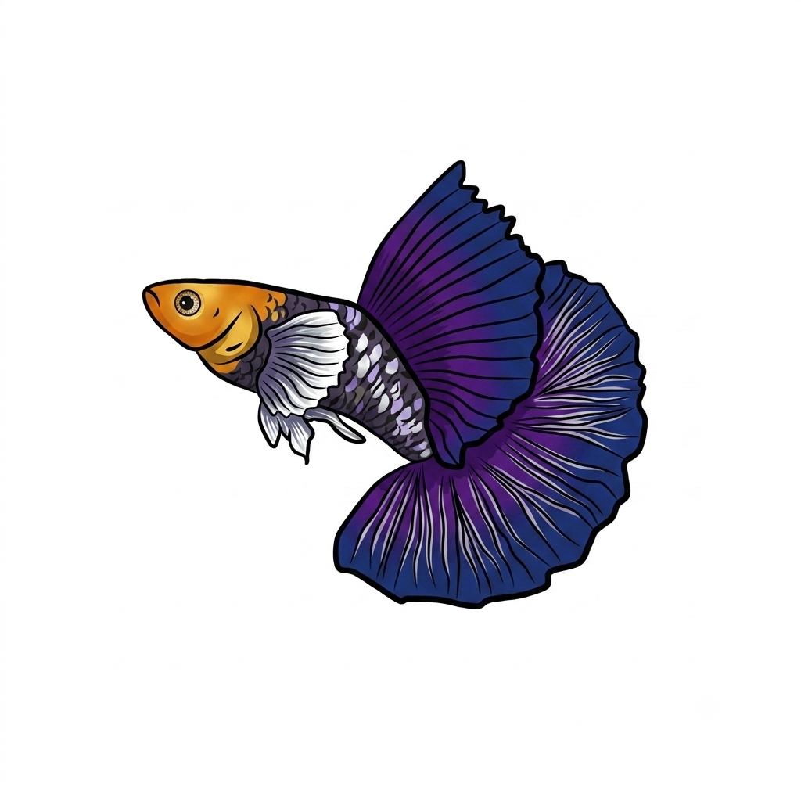

<p align="center">
  
</p>

# Guppy 🐟

**A verified agent harness for long-horizon software engineering.** Instead of just giving an LLM more tools and tokens, Guppy actively manages the **context → action → verification → memory → context** loop - and *proves* every step of it.

---

## Why we're building Guppy (the fish, and the point)

The AI world is full of **whales** - billion-dollar labs, GPU farms, and frameworks that make enormous claims on a single cherry-picked demo. A whale needs an ocean to live.

Guppy is named for the other end of the aquarium. The guppy (*Poecilia reticulata*) is one of the **hardiest, most adaptable fish on earth** - it thrives in a small tank, survives conditions that kill bigger fish, breeds forward every single generation, and does it all without an ocean. The "millions fish," it's called. We are not building a whale. **We are building a guppy.**

That's not a cute mascot - it's the engineering charter:

| The guppy | The harness |
|---|---|
| Survives in a small tank | **Solo-scale by design.** Git + SQLite + Docker. No K8s, no vector DBs, no GPU training. Runs on a laptop. |
| Hardy in bad water | **Works on free-tier models** and runs its whole test suite **offline, with no API keys** (deterministic-first). |
| A "millions fish" - breeds every generation | **Compounding.** Memory → skills → sleep-cycle distillation, and nothing ships unless the benchmark proves it. |
| A community fish | **Built in the open.** The roadmap is a list of gated, measurable chunks anyone can pick up. |
| Colorful | The fullscreen TUI, live streaming, a real terminal experience. |
| Doesn't brag, just swims | **Evidence over vibes.** Every capability claim is a recorded run, a green test, or a merged artifact - never a screenshot of a demo that worked once. |

**The problem we're building against:** agent frameworks *claim*; they almost never *prove*. A model says "done" and the harness believes it. A framework says "self-improving" and there's one blog post. The result is a field where a demo is treated as evidence.

**What we're trying to achieve:** a harness where *the gate is the arbiter* - the machine decides the task is done, never the model's self-report - and where every improvement is benchmark-gated. We want to hand a computer a multi-hour task on a real repo and come back to either a proven-green result or a provably complete record of exactly where and why it stalled. And we want that to work for a solo developer on a laptop, not a lab.

---

## The promise

> **Hand Guppy a multi-hour task on a real repo, walk away, and come back to one of two things:**
>
> 1. **a proven-green result** - the full verification ladder passed (typecheck → lint → tests → property → integration → invariant gate), merged back into your repo, or
> 2. **an evidence trail** - the event log shows exactly where and why it stalled, and the log is *provably complete*: every byte the model ever saw is reconstructable from it.

In exchange, Guppy promises four things no raw model loop gives you:

1. **Proven, not claimed, success.** Layered verification gates (typecheck → lint → tests → property → integration → repo-declared invariant) with an escalation budget. The harness says "done" - the model's self-report never does.
2. **Full observability + replay.** Everything is event-sourced. `guppy trace` replays any session; `guppy resume` continues after crashes or a closed laptop. Long jobs survive interruptions.
3. **Compounding improvement.** Every trajectory is data. Recurring fixes distill into memory and skills, and changes are promoted only when the benchmark proves they help.
4. **Evidence over vibes.** The bench A/Bs every significant change against its baseline. Claims are measured, not asserted.

**Honest non-edges:** single-turn code quality and interactive polish are table stakes - those come from the models and the ecosystem, and we don't pretend to beat them. Our edge is the *loop that verifies, remembers, and improves*.

---

## What exists today (verified)

The learn → act → verify → remember loop is **built, tested, and proven on real free-tier models**:

- **Native model client + tool loop** (`@guppy/core`) - any OpenAI-compatible endpoint (OpenRouter, Groq, Google AI Studio, NVIDIA, local Ollama) with retry/backoff, streaming, and tool-call fallbacks for models that don't emit native tool calls.
- **Gated verify → retry → memory loop** (`@guppy/control-plane`) - baseline gate, attempt, verify, feed failures into the next attempt, distill the fix into memory, merge back under the gate.
- **The verification ladder** (`@guppy/verification-engine`) - levels 0–6, configurable per repo, missing tools are *skips with a note*, never agent faults.
- **Benchmark harness** (`@guppy/bench-runner`) - a hermetic 21-fixture suite (zero-dependency repos, ground truth = test exit code), A/B configs, `--dry-run`, `loop-demo`, and offline failure clustering (`sleep-cycle`).
- **Cross-repo memory + skills** - fixes distilled per repo *and* per user; skills teach conventions (`~/.guppy/skills`).
- **Hybrid context compression** - deterministic rolling recap + optional LLM summary, measured on real models (16 compressions bounding a 47 KB-ledger run; honest numbers in `docs/live/live-compression-ab.md`).
- **Docker sandbox** - the default launch mode with path containment and symlink defense; `--local` mode for containerless dev.
- **Event store** - append-only trajectories with a SQLite index; `guppy replay` / `guppy trace` / live streaming.
- **Model catalog** - 39 providers / 1,220 models, live-fetched, free-tier-first, with per-model cost/context metadata.
- **Fullscreen TUI** - `guppy chat` on a TTY, readline REPL as the piped fallback; plan mode, `/build` approval, themes, interrupts.

**The receipts:**

- **20/20** bench fixtures passing on `qwen/qwen3.6-27b` (Groq free) - `docs/bench-results/launch-qwen-groq/`
- **325 tests across 13 packages, all green**; `guppy-bench sanity` **21/21** fixtures clean (clean repo green, mutated red); container e2e (run/merge + resume) executing for real
- **Live recordings of real runs** - `docs/live/`: `live-run.md`, `live-chat.md`, `live-run-container.md`, `tui-signoff.md`, `live-compression-ab.md`

---

## Quick start

Requirements: Node ≥ 20, pnpm 11, and Docker Desktop (for the sandbox default).

```bash
pnpm install
pnpm build
pnpm test        # 325 tests across 13 packages

# Store your provider key in ~/.guppy/config.json (interactive wizard),
# or script it: `pnpm cli -- config set groq <key> --default-model qwen/qwen3.6-27b`
pnpm cli -- setup

# Interactive chat - fullscreen TUI on a terminal, readline REPL when piped
pnpm cli -- chat

# Browse the model catalog (no key needed)
pnpm cli -- models --compatible --limit 20

# One-shot gated task
pnpm cli -- run "fix the failing test"
```

See [`docs/USER-GUIDE.md`](docs/USER-GUIDE.md) for every command and flag, [`docs/FEATURES.md`](docs/FEATURES.md) for the feature inventory, [`docs/STATUS.md`](docs/STATUS.md) for the verified status and bug log, and [`docs/COMPETITOR-ANALYSIS.md`](docs/COMPETITOR-ANALYSIS.md) for how Guppy compares to the field.

---

## The roadmap - and how you can help

The destination is in [`docs/ULTIMATE-ROADMAP.md`](docs/ULTIMATE-ROADMAP.md): **Phase 0 (the proven, committed baseline) is done.** What's next is a sequence of gated phases - each one a chunk of work with a *measured* exit criterion, not a vibe:

- **Phase 1** - make observability structural: every byte the model sees is logged, and a gate test proves it (replay completeness)
- **Phase 2** - structured context: a repo map, cache-aligned prompts, a tiered model router (the "real large repo" unlock)
- **Phase 3** - guardrails: a declarative deny/allow/ask policy layer between the model and every action
- **Phase 4** - collaboration: auto-triggered reviewer agents, parallel fan-out, merge arbitration under the gate
- **Phase 5** - checkpointing: git-native time-travel, restore to turn N, diff, branch from it
- **Phase 6** - efficiency: round-trip collapse (a sandboxed tool that calls other tools, still gated)
- **Phase 7** - breadth: SWE-bench clone-and-build, the invariant gate live on real fixtures
- **Phase 8** - the flywheel: automatic skill distillation, benchmark-gated promotion, session search

**The culture is the product:** every change lands with a gate, every claim lands with evidence, and the bench A/B is how we argue. If that sounds like a place you want to write code, [CONTRIBUTING.md](CONTRIBUTING.md) is the door.

---

## Repository layout

```
apps/       control-plane (guppy CLI), bench-runner (guppy-bench), sleep-cycle
packages/   core, contracts, event-store, workspace, verification-engine,
            context-engine, memory, skills, mcp, models
docker/     executor sandbox image
docs/       status, capabilities, roadmap, live recordings, bench results
```

## Branching model

- **`main`** - the stable, verified harness: green build and full test suite.
- **`feature/nexus`** - forward-looking work (multi-agent, formal verification, memory, compression). Merged into `main` only once proven.

## License

Apache License 2.0 - see [`LICENSE`](LICENSE).

---

*Small tank. Hardy water. Millions of generations. That's the whole pitch.* 🐟
